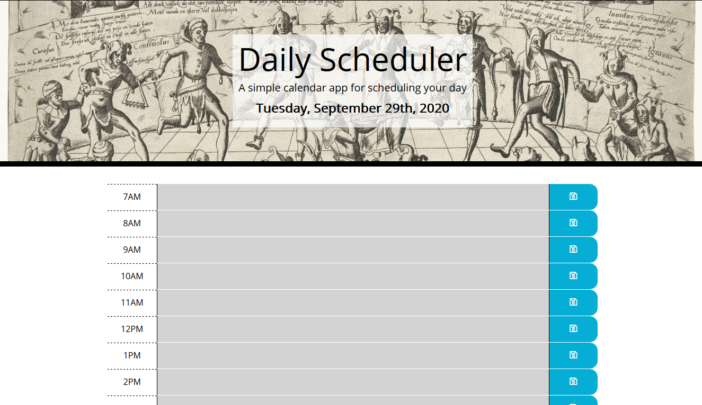

# Daily-Scheduler

This application is a product of an exercise in handling jQuery API and other JS libraries to create a dynamic and interactive daily scheduler. 

## Some of the basic features:
* Each hour has a dedicated time slot, where any text may be entered and saved by clicking a button to the right of each time slot.
* Reloading the page does not affect the tasks saved on the schedule for that day - all tasks persist. 
* A finished application resets itself on each new date and erases any data stored the previous day. 

## On the technical side:
* Most of the HTML is created dynamically via jQuery API and utilizing Moment.js to manipulate time.
* In addition to the above, the dynamic CSS code is powered by Bootstrap, FontAwesome icon library, and Google fonts. 
* The schedule data is stored and retrieved using localStorage functionality. 

## Link to the finished application: 

[Daily Scheduler](https://bohdicave.github.io/Daily-Scheduler/)

## Screenshots

